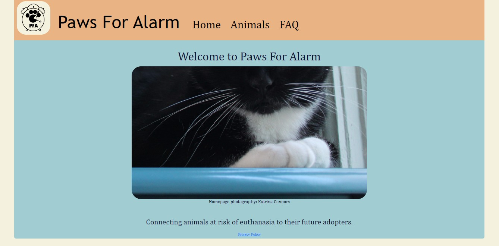
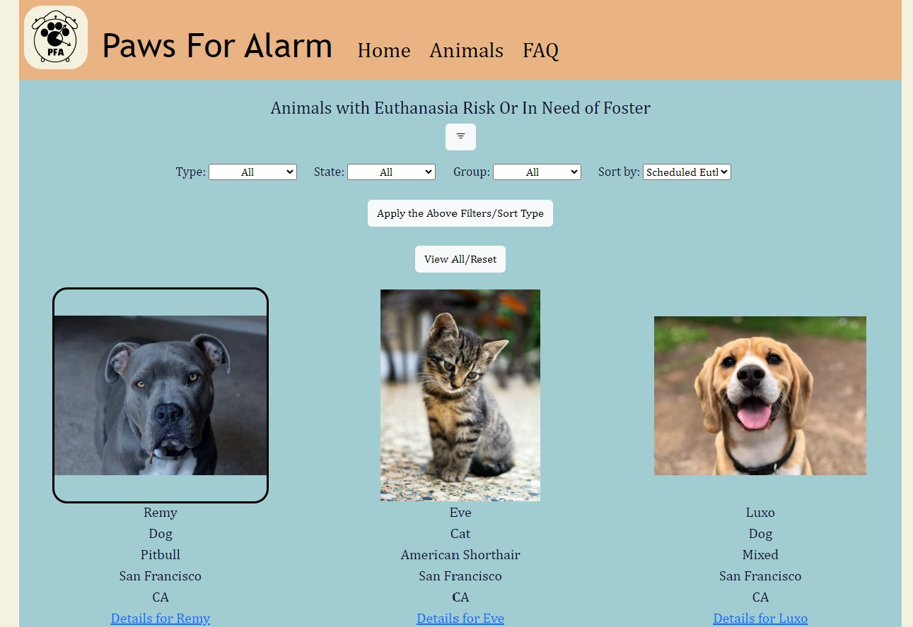

# pawsforalarm 

### Description:
Paws For Alarm consolidates listings for animals at risk of euthanasia. As a secondary goal, it endorses animals in need of foster homes.  
The app supports manual entry by an admin, but primarily sources information from the RescueGroups.org API. 
PFA has an interface to support adding new animals and updating information each time data is ingested from external sources. 
Users can view all available animals, or filter results (by species, location, and organizational group).  

### Setup:
Create a virtual environment.  
Install the items in requirements.txt  
You will need to request an API key from RescueGroups.org. 
To use the manual entry features, you'll need to generate an authentication token. 
Additionally, a password is used for code implemented to prevent CSRF attacks- this will need to be generated.  

### Creator Credit: 
In pursuit of following the educational use terms of RescueGroups.org's API, unsplash images were used to replace shelter animal images for this file. 
When the site launches and the API key use changes, this may be updated. 
  
Thank you to the following unsplash photographers. 
@lacellia 
@e_d_g_a_r 
@marliesestreefland 