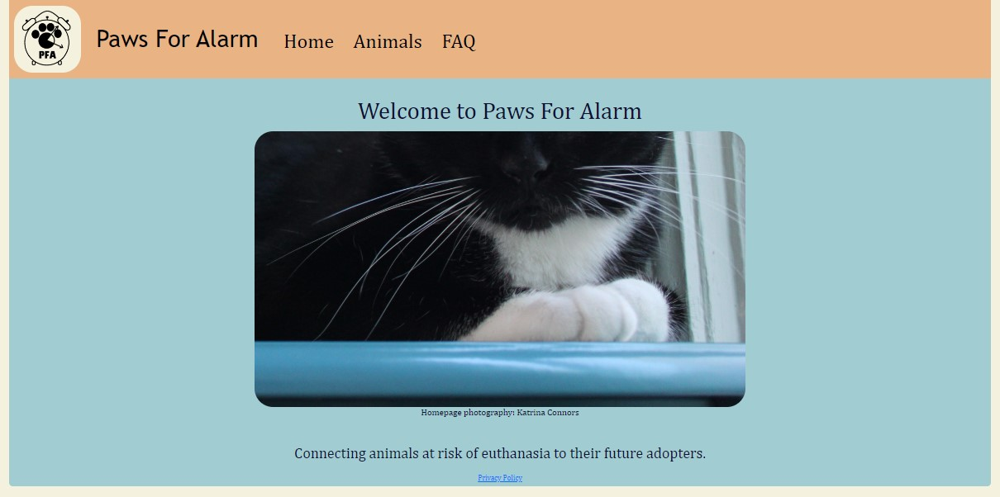
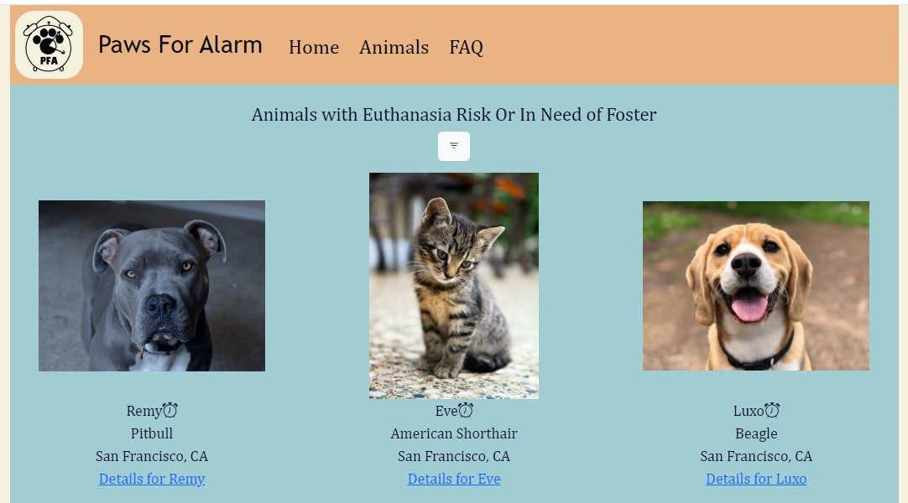
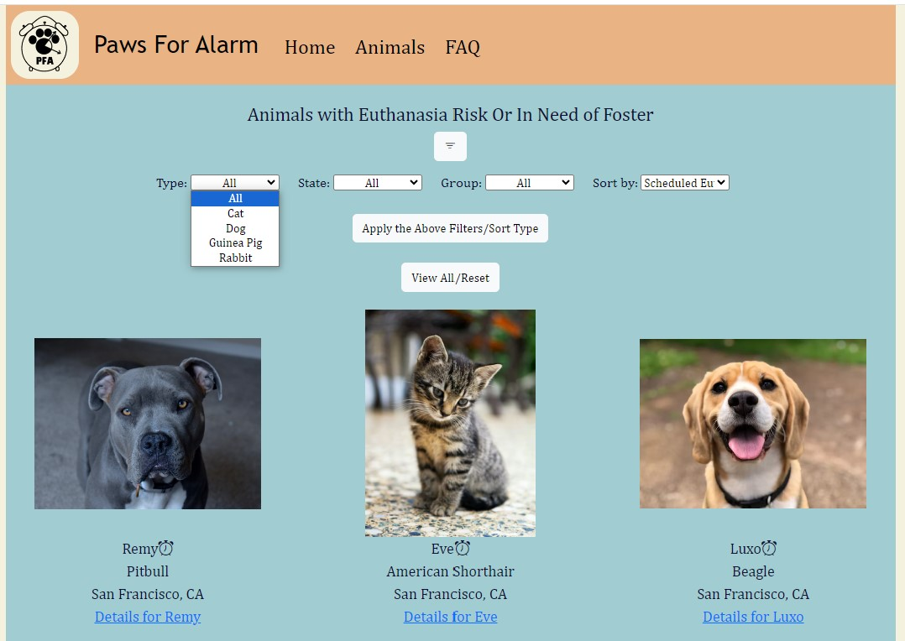
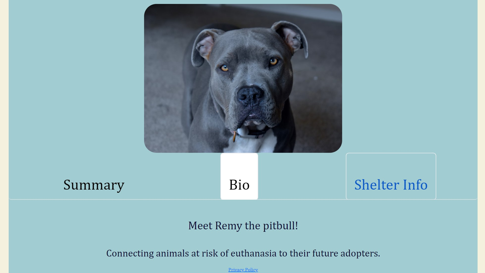

# Paws For Alarm

## Description

Paws For Alarm consolidates listings for animals at risk of euthanasia. As a secondary goal, it endorses animals in need of foster homes.  
The app supports manual entry by an admin, but primarily sources information from the RescueGroups.org API. 
PFA has an interface to support adding new animals and updating information each time data is ingested from external sources. 
  
Users can view all available animals, or filter results (by species, location, and organizational group). 
The dropdown on the species filter leverages a query and fields are dynamically updated based on the species that are in the database. 

  

Within each animal detail page, there are Bootstrap element tabs to separate the appropriate data.  
  
 

## Admin Routes

Both admin routes have client and server side validation. 
A notable feature of the add animal route is the ability for the admin to search for a shelter in the database without leaving the page. 
An AJAX request is made which returns JSON data and updates the DOM- in this case, the dropdown menu.  

## Technologies Used

Python 
Flask 
PostgreSQL 
SQLAlchemy 
Jinja  
HTML 
CSS 
JavaScript 
AJAX 
JSON 
Bootstrap 

## Setup

Create a virtual environment.  
Install the items in requirements.txt  
You will need to request an API key from RescueGroups.org. 
To use the manual entry features, you'll need to generate an authentication token. 
Additionally, a password is used for code implemented to prevent CSRF attacks- this will need to be generated.  
Run seed.py and rescueorg.py  

## Reminders after changes to model.py

Make changes to forms.py (in the case of changing data type) 
Run seed.py  
Run rescueorg.py  
Confirm local behavior  
Deploy changes to server  
Note that you may need to stop flask using "sudo systemctl stop flask"

## Running locally

Source your secrets file  
`source secrets.sh`

Activate virtual environment  
`source env/bin/activate`

Run server file  
` python3 server.py`

## Creator Credit 

Unsplash images were used to replace shelter animal images for the README file. 
Thank you to the following unsplash photographers. 
@lacellia 
@e_d_g_a_r 
@marliesestreefland 
